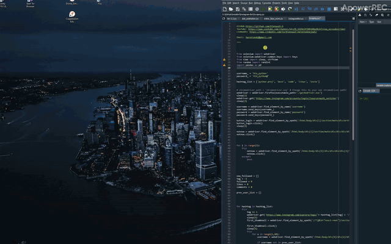

# Instagram Bot
 Automate your Instagram activity with two approaches:
	1) InstaBot >> a customisable bot that likes, follows and comments
	2) WEB scraping 
	


## WEB scraping

To be clear, I’m not using this bot intensively, as Instagram will stop responding if you run it too fast. It needs to have some sleep commands in between the actions, because after some comments and follows in a short period of time, Instagram stops responding and the bot crashes.


Moreover, please feel free to give us your feedback to share your experience.





## Install

### Dependencies

You need dependencies below.

- python3
- tkinter
- platform
- pytube


### Install repo and requirements

Clone the repo and install 3rd-party libraries.

```bash
$ git clone https://github.com/Kianoush-h/YouTube-Downloder
$ cd YouTube-Downloder
$ pip3 install -r requirements.txt
```


## Demo

### Test Inference

You can test the the app with this:

```
$ python3 YouTube_Downloader_Ver1.1.py
```


Then you will see the screen as below :


You need to copy and paste the URL, and in a few seconds, the app downloads the video in your specified folder.


Furthermore, you can see the video description before downloading.


## Future

In the next versions, you will be able to download the whole playlist if you want.


Moreover, please feel free to give us your feedback to share your experience.


# Contact Me

Email: haratiank2@gmail.com

YouTube channel: https://www.youtube.com/channel/UCvf9_53f6n3YjNEA4NxAkJA?view_as=subscriber
GitHub: https://github.com/Kianoush-h
LinkedIn: https://www.linkedin.com/in/kianoush-haratiannejadi/

