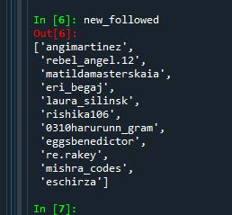
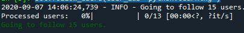
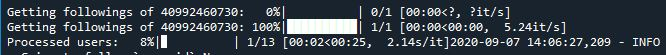
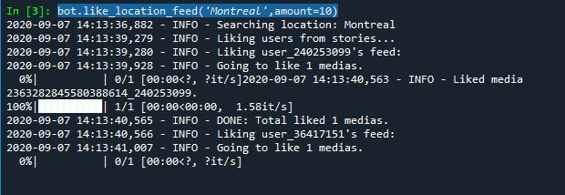

# Instagram Bot
 Automate your Instagram activity with two approaches:
 
	1) WEB scraping 
	
	2) InstaBot >> a customizable bot that likes, follows, and comments

	


## 1) WEB scraping

The code tries to Login with your username and password. Then, searched for random posts based or your specified hashtag list. The code opens each post, then likes it and follows the post owner if you have not followed it before.

Furthermore, the code puts comments randomly. You can modify the list of comments, which by default it is:

`"
Really cool!', 'Nice work :),' 'Nice gallery!!', 'So cool! :)'

`"


To be clear, I'm not using this bot intensively, as Instagram will stop responding if you run it too fast. It needs to have some sleep commands in between the actions, because after some comments and follows in a short period, Instagram stops responding, and the bot crashes.


Moreover, please feel free to give us your feedback to share your experience.


### Install

#### Dependencies

You need the following dependencies:

- python3
- selenium
- instabot
- random


### Install repo and requirements

Clone the repo and install 3rd-party libraries.

```bash
$ git clone https://github.com/Kianoush-h/Instagram-Bot.git
$ cd Instagram-Bot
$ pip3 install -r requirements.txt
`"


### Demo

First, you need to add your username and password:

`"
username_ = 'Your Username'
password_ = 'Your Pass'
`"

Second, you can edit the hashtag list:

``` 
hashtag_list = ['python proj', 'best', 'code', 'linux', 'insta']

`"

You can run the code with this:

`"
$ python3 Scraping.py
`"

You can see the code is running and started to follow, like, and put comments for random posts. 


After it stopped, you can check the list of your likes and new followers:




## 2) InstaBot

This project will show how to use an Instagram bot, which likes, comments, follows, and un-follow users automatically. This project will work on most of the platforms of Debian/Linux. 


### Login to your Instagram

You can log in with this library like this:

`"
from instabot import Bot

username_ = 'Your Username'
password_ = 'Your Pass'

bot = Bot()

bot.login(username = username_,
          password = password_)
`"


If everything is all right, you will see Login successful. 


### Demo


You can run the code with this:

`"
python3 InstagramBot.py
`"

To follow users with specific tags:

```
users = ['python','python.learning','codder', 'kinaoush']

bot.follow_users(user_ids='python.learning')
`"







To like related posts to a specific location:

```
locs = ['Montreal', 'Canada', 'US','Iran']

for i in locs:
    bot.like_location_feed(i,amount=10)

`"




### More Properties

**Like_per_day:** as Instagram has a limit of 1000 likes a day, you should not exceed it more than 1000. if you want to like more in a few hours and use those 1000 likes in ex 6 hours, you can edit accordingly. But if you'll exceed, you might get reported and face the ban.

**tag_list=['#tag1', '#tag2', '#tag3']:** To reach to specific audience you can use this. By adding tags , bot will only like and follow the media in which provided #tags are used.

**follow/comment_per_day:** This will follow or comment as per the usage. and you can replace 0 with a number as many as you want. (I will suggest you play inside a couple of hundreds for this.)

**follow_time=5*60*60:**  Following time. After the 5 Mins, the bot will follow each user.


You can check other properties on the InstaBot page.


## Future

In the next versions, I will design a GUI for it, which you do not need to edit the code manually anymore, and you can see a user-friendly app like my other apps.


Moreover, please feel free to give us your feedback to share your experience.


# Contact Me

Email: haratiank2@gmail.com

YouTube channel: https://www.youtube.com/channel/UCvf9_53f6n3YjNEA4NxAkJA?view_as=subscriber

GitHub: https://github.com/Kianoush-h

LinkedIn: https://www.linkedin.com/in/kianoush-haratiannejadi/

